# SEDAR+ Analyst Agent 


This project is an AI-powered platform for financial analysts to analyze Canadian public company filings from SEDAR+. It uses a multi-tool ReAct agent to answer complex questions, perform calculations, and retrieve real-time stock data, transforming dense documents into an interactive knowledge base.

The architecture is built on a modern, scalable stack, containerized with Docker, and orchestrated on Kubernetes, demonstrating a complete end-to-end MLOps workflow from data ingestion to a user-facing application.

## Key Features

  * **Conversational Q\&A**: Ask complex, multi-step questions about financial reports in natural language.
  * **Multi-Tool Agent**: The agent can retrieve information from documents (RAG), perform financial calculations, and fetch live stock market data.
  * **Scalable Architecture**: Built with a FastAPI backend and a Streamlit frontend, containerized with Docker and deployed on Kubernetes.
  * **Persistent Data**: Uses ChromaDB for vector storage and Kubernetes Persistent Volumes to ensure data durability.
  * **Secure Credential Management**: Leverages Kubernetes Secrets to manage sensitive API keys.

-----

## Technology Stack

| Component | Technology | Role in Project |
| :--- | :--- | :--- |
| **User Interface** | Streamlit | Provides the interactive web dashboard for the user. |
| **API Backend** | FastAPI | Serves the core AI agent logic via a REST API. |
| **AI Logic** | LlamaIndex | Builds the ReAct agent and RAG pipeline. |
| **LLM & Embeddings**| Nebius AI API | Provides the embedding and generative models. |
| **Vector Store** | ChromaDB | Stores and retrieves vector embeddings of the documents. |
| **Deployment** | Docker, Kubernetes (Minikube)| Containerizes and orchestrates the application services. |
| **Data Ingestion**| `pypdf`, Python Scripts | Extracts text from PDF documents for processing. |

-----

## Project Architecture

The application is deployed on Kubernetes and consists of several interconnected components:

1.  **Ingestion Job**: A one-time Kubernetes `Job` that processes raw documents, creates vector embeddings, and populates a persistent ChromaDB instance.
2.  **Backend Deployment**: A Kubernetes `Deployment` running the FastAPI application, which serves the multi-tool `ReActAgent`.
3.  **Frontend Deployment**: A Kubernetes `Deployment` running the Streamlit application, which provides the user interface.
4.  **Services**: Kubernetes `Services` (`ClusterIP` for the backend, `NodePort` for the frontend) handle networking between the components and expose the UI.
5.  **Persistent Storage**: A `PersistentVolumeClaim` provides durable storage for the ChromaDB vector store, ensuring the data survives pod restarts.

```mermaid
graph TD
    subgraph "User"
        U("👤 Financial Analyst")
    end

    subgraph "Kubernetes Cluster (analyst-agent Namespace)"
        U -- "Accesses via Browser" --> UIService("ui-service<br>(NodePort)");
        UIService --> UIPod("Pod: Streamlit UI");

        UIPod -- "HTTP API Call" --> BackendService("backend-service<br>(ClusterIP)");
        BackendService --> BackendPod("Pod: FastAPI Backend");

        subgraph "Data Ingestion (One-Time)"
            IngestJob("Job: Ingest Script") -- "Writes to" --> PVC("PersistentVolumeClaim<br>(vector-store-pvc)");
        end

        BackendPod -- "Mounts & Reads" --> PVC;
        BackendPod -- "Uses Credentials" --> Secret("Secret<br>(nebius-credentials)");
        BackendPod -- "Makes API Calls" --> NebiusAI("☁️ Nebius AI API");
    end
```

<!-- end list -->



-----

## How to Run This Project

### Prerequisites

  * Git
  * Python 3.10+
  * Docker Desktop
  * Minikube
  * `kubectl`

### 1\. Clone the Repository

```bash
git clone <your-repository-url>
cd analyst-agent
```

### 2\. Set Up Environment Variables

Create a `.env` file in the project root and add your Nebius AI credentials:

```env
NEBIUS_API_KEY="your-api-key-here"
NEBIUS_FOLDER_ID="your-folder-id-here"
```

### 3\. Build Docker Images

Build the necessary Docker images for the application components.

```bash
# Build the ingestion script image
docker build -t analyst-agent-ingester:0.1.0 -f ingest.Dockerfile .

# Build the backend API image
docker build -t analyst-agent-backend:0.1.0 -f backend/Dockerfile .

# Build the frontend UI image
docker build -t analyst-agent-ui:0.1.0 -f ui/Dockerfile .
```

### 4\. Deploy to Kubernetes

Ensure Minikube is running (`minikube start`). Then, load the images and apply the Kubernetes manifests in order.

```bash
# Load images into Minikube
minikube image load analyst-agent-ingester:0.1.0
minikube image load analyst-agent-backend:0.1.0
minikube image load analyst-agent-ui:0.1.0

# Apply Kubernetes manifests
kubectl apply -f k8s/01-namespace.yaml
kubectl create secret generic nebius-credentials --from-env-file=.env -n analyst-agent
kubectl apply -f k8s/03-vector-store-pvc.yaml
kubectl apply -f k8s/04-ingest-job.yaml

# Wait for the ingest job to complete
echo "Waiting for data ingestion job to complete..."
kubectl wait --for=condition=complete job/ingest-job -n analyst-agent --timeout=5m

# Deploy the backend and frontend
kubectl apply -f k8s/02-backend-deployment.yaml
kubectl apply -f k8s/05-backend-service.yaml
kubectl apply -f k8s/06-ui-deployment.yaml
kubectl apply -f k8s/07-ui-service.yaml
```

### 5\. Access the Application

Once all pods are in the `Running` state, expose the UI service:

```bash
minikube service ui-service -n analyst-agent
```

This command will open the Streamlit application in your default web browser.
